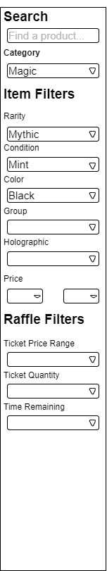

## Filters

Contains inputs for filtering the raffle list page as well as well as other pages such as the redeem page, and participating raffles page.

- Search: Searches database item table for item_name matching the search string, then returns all active raffles that contain that item.

- Category: This dropdown will hold product [categories](../database/table-relations) such as: Pokemon, Yu-Gi-Oh, Magic, etc.  (Fire Arms, Computer Hardware, could be examples of categories in the future.)

- Item Filters: This section will use database information to display the propper filters for the selected category.  For example, if the category is Magic, the filters will be:
- Sealed / Unsealed Product, 
- Condition, 
- Rarity, 
- Holographic, 
- Price Range

- Raffle Filters: This section will display filters for raffles attributes such as:
- Ticket Price Range
- Ticket Quantity 
- Time Remaining

